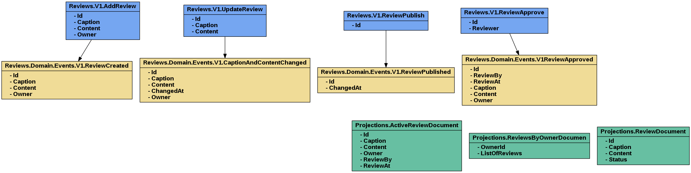

# Reviews
Reviews.V1.AddReview -> // Id, Caption,Content,Owner
Reviews.Domain.Events.V1.ReviewCreated // Id, Caption,Content,Owner

Reviews.V1.UpdateReview -> //Id,Caption,Content
Reviews.Domain.Events.V1.CaptionAndContentChanged  //Id, Caption,Content,ChangedAt,Owner

Reviews.V1.ReviewPublish -> //Id
Reviews.Domain.Events.V1.ReviewPublished //Id,ChangedAt

Reviews.V1.ReviewApprove -> //Id,Reviewer
Reviews.Domain.Events.V1ReviewApproved //Id,ReviewBy,ReviewAt,Caption,Content,Owner

Projections.ActiveReviewDocument*  //Id,Caption,Content,Owner,ReviewBy,ReviewAt
Projections.ReviewsByOwnerDocumen* //OwnerId, []ListOfReviews
Projections.ReviewDocument* //Id,Caption,Content,Status

